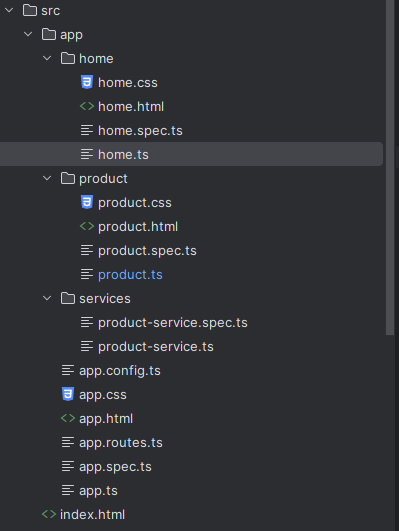
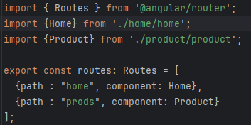
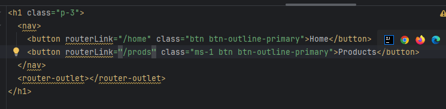
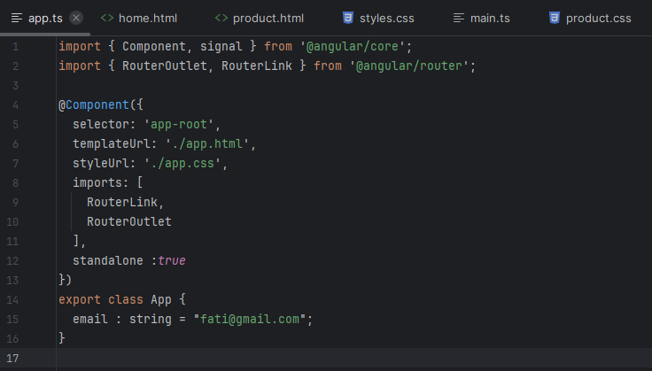
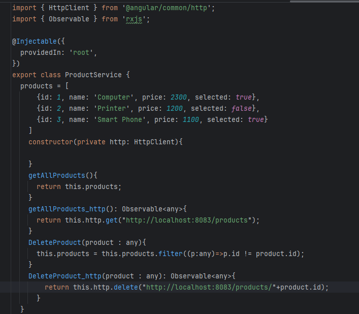
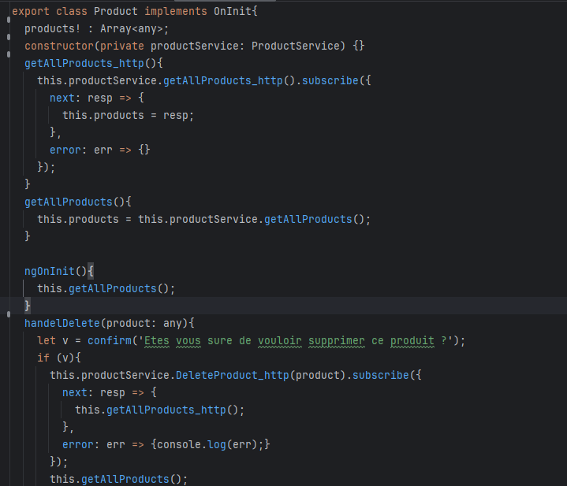
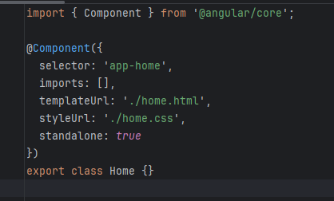

# EnsetApp - Application Angular Gestion de Produits

## Étape 1 : Installation d'Angular CLI

---

## Étape 2 : Création du projet et génération des composants

---

## Étape 3 : Structure du projet

---

## Étape 4 : Configuration des routes

---

## Étape 5 : Template principal

---

## Étape 6 : Composant racine

---

## Étape 7 : Service produit (local + HTTP)

---

## Étape 8 : Composant Product (gestion et suppression)

---

## Étape 9 : Composant Home

---

## Résumé

| Composant | Rôle |
|-----------|------|
| Home | Page d'accueil |
| Product | Liste et suppression des produits |
| ProductService | Gestion des données (local / HTTP) |

## Backend utilisé (optionnel)

- GET : `http://localhost:8083/products`
- DELETE : `http://localhost:8083/products/{id}`
